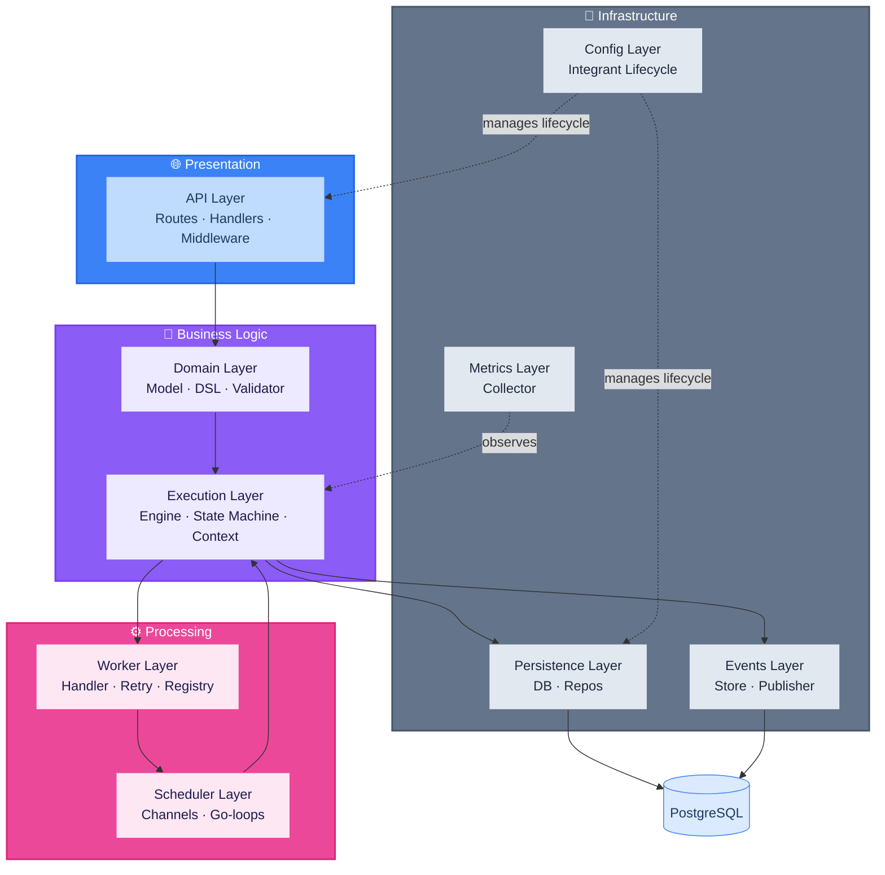
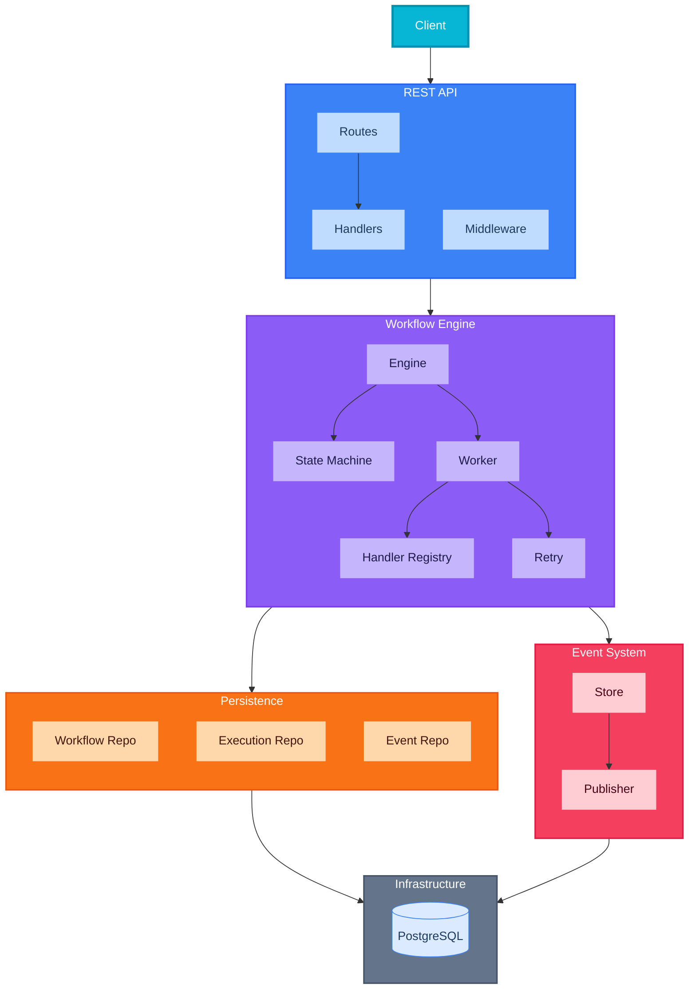
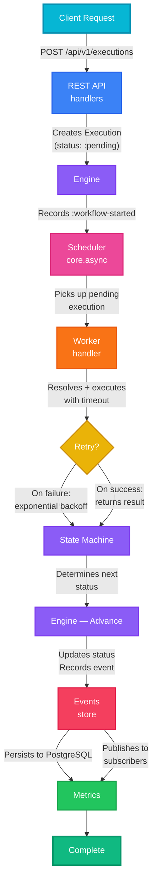
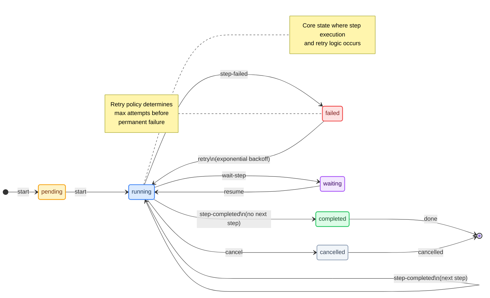
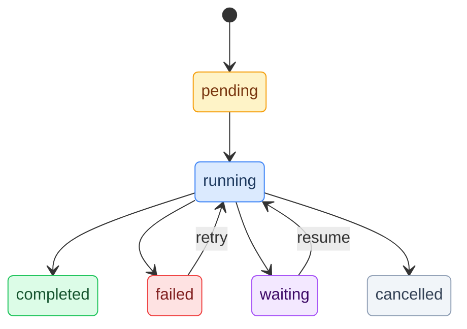

# workflow-engine — Clojure Workflow Engine POC

[](https://clojure.org/)
[](LICENSE)
[](#testing)
[](https://www.postgresql.org/)
[](https://www.docker.com/)

A proof-of-concept workflow engine built in Clojure, demonstrating data-as-code DSL design, event sourcing, state machine transitions, retry with exponential backoff, handler registry pattern, and PostgreSQL persistence — showcasing functional programming patterns for business process orchestration in a self-contained project.

## ⚠️ Disclaimer

This project is developed for **educational and research purposes** only. It is intended to provide hands-on experience and deepen knowledge in **functional programming patterns**, **event sourcing architecture**, and **workflow orchestration design**. It is **not designed** for deployment in production environments or real-world workflow systems.

The primary focus is to explore **Clojure's data-as-code paradigm**, **immutability-driven state management**, **core.async concurrency**, and **REPL-driven development** for building business process software, emphasizing developer learning and architectural exploration in a controlled environment.

## Why Clojure?

We picked Clojure for this POC because it fits really well with what a workflow engine needs. Here's why — each point explains the problem, how Clojure solves it, and where you can see it in action.

### Immutability by Default

**The problem:** A workflow engine constantly transitions between states — `pending → running → completed/failed`. When multiple workflows run concurrently, shared mutable state becomes a nightmare: race conditions, deadlocks, hard-to-reproduce bugs.

**How Clojure helps:** Every data structure in Clojure is immutable by default. When a step finishes, you don't *modify* the execution — you get a *new* execution with the updated status and context. No locks, no mutexes, no "oops I forgot to synchronize" moments.

In this engine, the `Execution` record is never mutated. Each step produces a fresh record with updated values. The state machine (`execution/state_machine.clj`) determines transitions purely from input data, not from shared mutable state.

### Data-as-Code DSL

**The problem:** Most workflow engines in Java/C# have a painful mismatch: workflows defined in code use classes and interfaces, but when they come from a REST API as JSON, you need serialization/deserialization layers, adapters, and conversion logic. It's a constant source of bugs.

**How Clojure helps:** Clojure is homoiconic — code *is* data and data *is* code. The workflow DSL returns plain maps. A workflow created via the REST API (JSON → Clojure maps) and one created in code (Clojure maps directly) are *structurally identical*. No classes, no interfaces, no conversion layer.

You can see this in `workflow/dsl.clj` — `linear-workflow` accepts either vector literals `[[:step1 :task handler-fn]]` or JSON-compatible maps `[{:id "step1" :type "task"}]`. Both produce the same `Workflow` record. The `step-from-map` function normalizes any map shape into a proper `Step` record.

### REPL-Driven Development

**The problem:** Traditional development cycles for business logic are slow — you change a handler, restart the server, re-create the workflow, re-run it. When your business logic changes daily, this friction adds up.

**How Clojure helps:** The REPL isn't just a console — it's a full development environment. You can hot-patch handlers at runtime without restarting anything. Modify a function, re-evaluate it, and the next execution uses the new version. Zero downtime.

Check out `demo/repl_demo.clj` for a walkthrough that does exactly this: it modifies a handler at runtime and shows the change taking effect on the next execution.

### core.async — CSP Concurrency

**The problem:** Concurrent workflow execution needs a clean way to distribute work without introducing complexity. Threads + locks are error-prone and hard to debug.

**How Clojure helps:** Clojure's `core.async` implements Communicating Sequential Processes (CSP) — a model where independent processes communicate through channels instead of sharing memory. The scheduler pushes work into a channel, workers pick it up, process it, and push results to another channel. No locks, no shared state, no race conditions.

The scheduler (`scheduler/core.clj`) uses `go-loop` to process pending executions. Event publishing uses channels for fan-out to subscribers. Everything communicates through channels — it's clean, composable, and easy to reason about.

### Functional Composition

**The problem:** Traditional OOP frameworks make you inherit from base classes, override methods, and wire things together with configuration files. Adding cross-cutting concerns (retry, timeout, logging) means more inheritance, more complexity.

**How Clojure helps:** Handlers are plain functions `(fn [context] result)`. You compose them with `comp`, `partial`, `->>`, and other standard Clojure tools. Need retry logic? Wrap your handler function. Need a timeout? Wrap it again. Complex behaviors emerge from combining small, testable functions.

You can see this in action: `worker/retry.clj` accepts a policy map and returns a composed handler. The middleware stack in `api/middleware.clj` uses function composition to build the request pipeline. Every handler in `worker/examples.clj` is a standalone function you can test in isolation.

### Java Interop

**The problem:** You want mature, battle-tested libraries for database access, HTTP, JSON — not half-baked Clojure-only alternatives.

**How Clojure helps:** Clojure runs on the JVM, so you get full access to the entire Java ecosystem without ceremony. PostgreSQL drivers via `next.jdbc`, JSON via `cheshire`, HTTP via `ring`, connection pooling via `hikari-cp` — all standard, well-maintained libraries used idiomatically from Clojure.

### Event Sourcing

**The problem:** When a workflow fails, you need to know exactly what happened — which step failed, what the context was at that point, and what events led to the failure. Logs are great, but they're not structured or queryable.

**How Clojure helps:** Every state change produces an immutable event record. The engine records `workflow-started`, `step-started`, `step-completed`, `step-failed`, and `workflow-completed` events for every execution. These events are both persisted to PostgreSQL (for audit and replay) and published to in-process subscribers (for real-time monitoring).

The event store (`events/store.clj`) and event repo (`persistence/event_repo.clj`) handle the dual-write: durability for compliance, and live pub/sub for dashboards.

## Architecture

### Layered Architecture

The project follows a **layered architecture** with clear separation of concerns. The 9 layers are grouped into 4 logical domains:

- **Presentation** — HTTP interface (API layer)
- **Business Logic** — Domain model and execution orchestration
- **Processing** — Async work distribution (worker + scheduler)
- **Infrastructure** — Persistence, events, metrics, and lifecycle config



#### Layer Responsibilities

| Layer | Responsibility | Key Files |
|-------|----------------|-----------|
| **API** | HTTP interface, request routing, middleware stack, JSON serialization | `api/handlers.clj`, `api/routes.clj`, `api/middleware.clj`, `api/server.clj` |
| **Domain** | Business entities, workflow DSL, validation rules | `workflow/model.clj`, `workflow/dsl.clj`, `workflow/validator.clj` |
| **Execution** | Workflow orchestration, state transitions, context management, protocol-based dependency injection | `execution/engine.clj`, `execution/state_machine.clj`, `execution/context.clj`, `execution/ports.clj`, `execution/adapters.clj`, `execution/step_executor.clj`, `execution/transitions.clj` |
| **Worker** | Step execution, retry policies, handler registry | `worker/handler.clj`, `worker/retry.clj`, `worker/registry.clj` |
| **Scheduler** | Asynchronous work distribution via CSP channels | `scheduler/core.clj`, `scheduler/channels.clj` |
| **Events** | Event sourcing, in-process pub/sub | `events/store.clj`, `events/publisher.clj` |
| **Persistence** | PostgreSQL data access, CRUD operations | `persistence/db.clj`, `persistence/workflow_repo.clj`, `persistence/execution_repo.clj`, `persistence/event_repo.clj` |
| **Metrics** | In-memory counters, histograms, percentiles | `metrics/collector.clj` |
| **Config** | Component lifecycle management | `config/system.clj` |

### Component Diagram



### Execution Flow

The following diagram illustrates how a workflow execution flows through the system:



## Architecture Patterns

This project implements several well-known software architecture patterns, adapted to leverage Clojure's functional paradigm:

### Data-as-Code Paradigm

**Pattern:** Workflows, steps, executions, and events are all plain data structures (records and maps). No OOP class hierarchies, no interfaces, no serialization boundaries.

**Implementation:** The DSL produces Clojure maps that are structurally identical to JSON from the REST API. A workflow created in code and one created via HTTP are interchangeable.

```clojure
;; Code-defined workflow
(dsl/linear-workflow
  "wf-1" "Order Processing" 1
  [{:id "validate" :type "task"}
   {:id "charge"   :type "task"}
   {:id "ship"     :type "task"}])

;; API-defined workflow (JSON → Clojure maps)
;; POST /api/v1/workflows
;; {"name":"Order Processing", "steps":[{"id":"validate","type":"task"}, ...]}
;; Both produce identical Workflow records
```

**Benefits:**
- Zero impedance mismatch between code and data
- JSON API input and Clojure code produce identical structures
- Workflows can be inspected, modified, and serialized as plain data

### Event Sourcing

**Pattern:** Every state change produces an immutable event record. The event store provides a complete audit trail of workflow execution.

**Implementation:** Events are persisted to PostgreSQL AND published to in-process subscribers. This dual-write provides both durability (for audit/replay) and real-time notification (for monitoring/dashboards).

```clojure
;; Event recording
(record-workflow-started! datasource execution-id)
(record-step-started! datasource execution-id step-id)
(record-step-completed! datasource execution-id step-id result)
(record-step-failed! datasource execution-id step-id error)
(record-workflow-completed! datasource execution-id)
```

**Event Types:**
| Event | Trigger | Data |
|-------|---------|------|
| `:workflow-started` | Execution begins | execution-id, workflow-id, timestamp |
| `:step-started` | Step execution begins | execution-id, step-id, timestamp |
| `:step-completed` | Step finishes successfully | execution-id, step-id, result, duration |
| `:step-failed` | Step execution fails | execution-id, step-id, error, duration |
| `:workflow-completed` | All steps finish | execution-id, final-context |
| `:workflow-failed` | Workflow fails | execution-id, error, failed-step |
| `:workflow-cancelled` | Execution cancelled | execution-id, reason |

### State Machine

**Pattern:** Explicit state transitions defined in a transition map. Invalid transitions are impossible.

**Implementation:** The state machine (`execution/state_machine.clj`) defines a `valid-transitions` map and a `determine-next-status` function that maps step type + result to the next status.



**State Transitions:**
| Current State | Event | Next State |
|---------------|-------|------------|
| `:pending` | `start` | `:running` |
| `:running` | `step-completed` | `:completed` / `:running` (next step) |
| `:running` | `step-failed` | `:failed` |
| `:running` | `wait-step` | `:waiting` |
| `:running` | `cancel` | `:cancelled` |
| `:failed` | `retry` | `:running` |
| `:waiting` | `resume` | `:running` |

### Handler Registry (Service Locator)

**Pattern:** Handlers are registered by step ID in a global atom-based registry. This decouples handler implementation from workflow definitions.

**Implementation:** The registry (`worker/registry.clj`) allows workflows defined via JSON API (no handlers in definition) to execute via registered handlers. Handlers can be hot-patched at runtime.

```clojure
;; Register handler
(registry/register-handler! "create-user"
  (fn [ctx] {:user-id (str "USR-" (System/currentTimeMillis))}))

;; Engine resolves: step.handler → registry fallback
```

### CSP Concurrency (Communicating Sequential Processes)

**Pattern:** Work distribution through channels without locks, mutexes, or shared mutable state.

**Implementation:** The scheduler uses `core.async` channels for work distribution. Work items flow through `work-ch` → workers → `result-ch` → result processor.

```clojure
;; Channel-based work distribution
(go-loop []
  (when-let [execution (<! work-ch)]
    (execute-step! execution)
    (recur)))
```

**Benefits:**
- Lock-free concurrency
- Composable communication patterns
- Natural backpressure via channel buffering

### Repository Pattern

**Pattern:** Abstract database access behind repository interfaces.

**Implementation:** Three repositories handle persistence:
- `workflow_repo.clj` — Workflow CRUD with JSONB serialization
- `execution_repo.clj` — Execution CRUD with state transitions
- `event_repo.clj` — Event persistence and querying

### Middleware Composition

**Pattern:** Build request processing pipeline through function composition.

**Implementation:** Ring middleware stack in `api/middleware.clj`:

```clojure
(defn wrap-defaults [handler]
  (-> handler
      wrap-exception-handling
      wrap-cors
      wrap-json-body
      wrap-json-response
      wrap-request-logging))
```

### Retry with Exponential Backoff

**Pattern:** Configurable retry policies with exponential backoff for transient failures.

**Implementation:** Per-step retry configuration:

```clojure
{:id "process-payment"
 :type :task
 :retry {:max-attempts 3 :base-delay 500 :max-delay 5000}
 :timeout 10000}
```

**Strategies:**
- Exponential backoff with configurable base/max delay
- Fixed delay policy
- Per-step timeout via future deref with timeout
- Automatic retry on `{:error ...}` results

### Component Lifecycle (Integrant)

**Pattern:** Declare system components in a configuration map with explicit dependency ordering.

**Implementation:** Integrant manages initialization and shutdown of all components:

```clojure
{::db {}
 ::publisher {}
 ::metrics {}
 ::scheduler {:datasource (ig/ref ::db)
             :publisher (ig/ref ::publisher)
             :metrics (ig/ref ::metrics)}
 ::server {:datasource (ig/ref ::db)
           :publisher (ig/ref ::publisher)
           :metrics (ig/ref ::metrics)}}
```

## Technology Stack

### Core Language & Runtime

| Technology | Version | Purpose |
|------------|---------|---------|
| **Clojure** | 1.11.1 | Functional Lisp on JVM |
| **JDK Temurin** | 21 | Java Virtual Machine runtime |

### Application Dependencies

| Library | Version | Purpose |
|---------|---------|---------|
| `org.clojure/clojure` | 1.11.1 | Core language runtime |
| `org.clojure/core.async` | 1.6.681 | CSP concurrency (channels, go-blocks) |
| `org.clojure/tools.logging` | 1.3.0 | Structured logging |
| `ring/ring-core` | 1.11.0 | HTTP request/response abstractions |
| `ring/ring-jetty-adapter` | 1.11.0 | Embedded Jetty HTTP server |
| `ring/ring-json` | 0.5.1 | JSON body parsing/serialization |
| `metosin/reitit` | 0.7.0 | Data-driven routing |
| `metosin/reitit-ring` | 0.7.0 | Ring integration for Reitit |
| `metosin/reitit-middleware` | 0.7.0 | Routing middleware |
| `integrant/integrant` | 0.10.0 | Component lifecycle management |
| `com.github.seancorfield/next.jdbc` | 1.3.909 | JDBC database access |
| `hikari-cp/hikari-cp` | 3.3.0 | Connection pooling |
| `org.postgresql/postgresql` | 42.7.1 | PostgreSQL JDBC driver |
| `cheshire/cheshire` | 5.12.0 | JSON encoding/decoding |

### Testing Dependencies

| Library | Version | Purpose |
|---------|---------|---------|
| `lambdaisland/kaocha` | 1.91.1392 | Test runner with suite support |
| `cloverage/cloverage` | 1.2.4 | Code coverage measurement |
| `org.slf4j/slf4j-simple` | 2.0.13 | Logging for test runs |

### Build & Development Dependencies

| Library | Version | Purpose |
|---------|---------|---------|
| `org.clojure/tools.build` | 0.9.2 | Uberjar creation |
| `nrepl/nrepl` | 1.1.1 | nREPL server for REPL-driven development |
| `cider/cider-nrepl` | 0.49.0 | CIDER middleware for editor integration |

### Infrastructure

| Technology | Version | Purpose |
|------------|---------|---------|
| **PostgreSQL** | 16-alpine | Primary data store |
| **Docker** | multi-stage build | Containerization |
| **Docker Compose** | v2 | Service orchestration |
| **Rake** | Ruby | Build automation |

### Package Structure

| Package | Responsibility |
|---------|----------------|
| `workflow-engine.api.handlers` | REST API handlers (create, get, list, delete workflows; start, get, cancel, retry executions) |
| `workflow-engine.api.routes` | Reitit route definitions and router construction |
| `workflow-engine.api.server` | Jetty HTTP server lifecycle |
| `workflow-engine.api.middleware` | JSON body parsing, CORS, exception handling |
| `workflow-engine.config.system` | Integrant system configuration and lifecycle |
| `workflow-engine.workflow.model` | Domain records: `Workflow`, `Step`, `Execution`, `Event` |
| `workflow-engine.workflow.dsl` | Workflow definition DSL (`linear-workflow`, `task-step`, etc.) |
| `workflow-engine.workflow.validator` | Workflow and execution validation |
| `workflow-engine.execution.engine` | Core execution engine: start, execute-step, advance, cancel, retry — delegates to step-executor and transitions modules |
| `workflow-engine.execution.state-machine` | State transition rules and status determination |
| `workflow-engine.execution.context` | Execution context creation and merging |
| `workflow-engine.execution.ports` | Protocol definitions: `ExecutionStore`, `EventRecorder`, `EventPublisher`, `MetricsCollector` |
| `workflow-engine.execution.adapters` | Protocol implementations delegating to concrete persistence, events, and metrics modules |
| `workflow-engine.execution.step-executor` | Handler resolution (inline → registry fallback) and step execution wrapper |
| `workflow-engine.execution.transitions` | Next-step determination and execution update building |
| `workflow-engine.worker.handler` | Step execution with timeout and retry orchestration |
| `workflow-engine.worker.retry` | Retry policies: exponential backoff, fixed delay |
| `workflow-engine.worker.registry` | Global handler registry (atom-based) |
| `workflow-engine.worker.examples` | Example handler implementations |
| `workflow-engine.events.store` | Event recording (workflow/step lifecycle events) |
| `workflow-engine.events.publisher` | In-process event pub/sub (atom-based) |
| `workflow-engine.persistence.db` | HikariCP datasource management |
| `workflow-engine.persistence.db-config` | Database configuration from environment |
| `workflow-engine.persistence.workflow-repo` | Workflow CRUD (PostgreSQL + JSONB) |
| `workflow-engine.persistence.execution-repo` | Execution CRUD with state transitions |
| `workflow-engine.persistence.event-repo` | Event persistence and querying |
| `workflow-engine.metrics.collector` | In-memory metrics (counters, histograms) |
| `workflow-engine.scheduler.core` | Core.async scheduler for pending executions |
| `workflow-engine.scheduler.channels` | Channel definitions for work distribution |
| `workflow-engine.core` | Application entrypoint (`-main`) |

## Domain Model

### Core Entities

#### Workflow

Represents a workflow definition with ordered steps.

```clojure
(defrecord Workflow [id name version steps metadata])
```

| Field | Type | Description |
|-------|------|-------------|
| `id` | String | Unique workflow identifier |
| `name` | String | Human-readable workflow name |
| `version` | Integer | Workflow version number |
| `steps` | Vector | Ordered list of Step records |
| `metadata` | Map | Additional workflow metadata |

#### Step

Represents a single unit of work within a workflow.

```clojure
(defrecord Step [id type handler retry timeout branches])
```

| Field | Type | Description |
|-------|------|-------------|
| `id` | String | Unique step identifier |
| `type` | Keyword | Step type: `:task`, `:wait`, `:decision`, `:parallel` |
| `handler` | Function | Step execution function `(fn [context] result)` |
| `retry` | Map | Retry policy configuration |
| `timeout` | Integer | Maximum execution time in milliseconds |
| `branches` | Map | Branch definitions for `:decision` steps |

**Step Types:**
| Type | Description | Behavior |
|------|-------------|----------|
| `:task` | Standard processing step | Executes handler, returns result |
| `:wait` | Pauses execution | Sets status to `:waiting`, awaits resume |
| `:decision` | Conditional branching | Evaluates result, selects next branch |
| `:parallel` | Concurrent execution | Fans out to multiple branches, fans in results |

#### Execution

Represents a running or completed workflow instance.

```clojure
(defrecord Execution [execution-id workflow-id status current-step
                      started-at updated-at context history])
```

| Field | Type | Description |
|-------|------|-------------|
| `execution-id` | String | Unique execution identifier |
| `workflow-id` | String | Reference to workflow definition |
| `status` | Keyword | Current status (see State Machine) |
| `current-step` | String | ID of the currently executing step |
| `started-at` | Timestamp | Execution start time |
| `updated-at` | Timestamp | Last update time |
| `context` | Map | Execution context (input + accumulated results) |
| `history` | Vector | List of completed step IDs |

#### Event

Represents an immutable record of a state change.

```clojure
(defrecord Event [type execution-id step timestamp data])
```

| Field | Type | Description |
|-------|------|-------------|
| `type` | Keyword | Event type (see Event Sourcing) |
| `execution-id` | String | Reference to execution |
| `step` | String | Step ID (if step-related event) |
| `timestamp` | Timestamp | Event creation time |
| `data` | Map | Event-specific payload |

### Execution Context

The execution context is a plain map passed through the workflow, accumulating results from each step.

```clojure
;; Initial context (from API input)
{:input {:user-id "123" :email "user@example.com"}
 :started-at #inst "2026-08-15T10:00:00Z"}

;; After step "create-user"
{:input {:user-id "123" :email "user@example.com"}
 :started-at #inst "2026-08-15T10:00:00Z"
 :last-result {:user-id "USR-12345"}
 :create-user {:user-id "USR-12345"}}

;; After step "send-email"
{:input {:user-id "123" :email "user@example.com"}
 :started-at #inst "2026-08-15T10:00:00Z"
 :last-result {:sent true}
 :create-user {:user-id "USR-12345"}
 :send-email {:sent true}}
```

### Workflow DSL

The DSL provides a concise way to define workflows in code:

```clojure
;; Linear workflow (sequential steps)
(dsl/linear-workflow
  "wf-user-registration"
  "User Registration Pipeline"
  1
  [{:id "create-user" :type "task"}
   {:id "send-email" :type "task"}
   {:id "register-analytics" :type "task"}])

;; Task step with handler
(dsl/task-step "process-order"
  (fn [ctx]
    {:order-id (str "ORD-" (System/currentTimeMillis))}))

;; Wait step (pauses execution)
(dsl/wait-step "await-approval"
  :description "Waiting for manual approval")

;; Decision step (conditional branching)
(dsl/decision-step "check-inventory"
  (fn [ctx]
    (if (> (get-in ctx [:input :quantity]) 10)
      :bulk :single))
  {:bulk   [(dsl/task-step "process-bulk-order" ...)]
   :single [(dsl/task-step "process-single-order" ...)]})

;; Parallel step (concurrent execution)
(dsl/parallel-step "validate-and-check"
  [(dsl/task-step "validate-data" ...)
   (dsl/task-step "check-fraud" ...)])
```

## Features

### REST API

Full CRUD for workflows and executions via REST endpoints:

| Method | Endpoint | Description |
|--------|----------|-------------|
| `POST` | `/api/v1/workflows` | Create workflow (JSON body with steps) |
| `GET` | `/api/v1/workflows` | List all workflows |
| `GET` | `/api/v1/workflows/:id` | Get workflow by ID |
| `DELETE` | `/api/v1/workflows/:id` | Delete workflow |
| `POST` | `/api/v1/executions` | Start execution (workflow-id + input) |
| `GET` | `/api/v1/executions?workflow_id=X` | List executions for workflow |
| `GET` | `/api/v1/executions/:id` | Get execution status and context |
| `POST` | `/api/v1/executions/:id/cancel` | Cancel running execution |
| `POST` | `/api/v1/executions/:id/resume` | Resume waiting execution |
| `POST` | `/api/v1/executions/:id/retry` | Retry failed execution |
| `GET` | `/api/v1/health` | Health check with version |

### State Machine

Explicit state transitions with validated status:



The state machine (`execution/state_machine.clj`) defines valid transitions and prevents invalid state changes. Step types (`:task`, `:wait`, `:decision`, `:parallel`) determine how results map to status transitions.

### Retry with Exponential Backoff

Per-step retry configuration:

```clojure
{:id "process-payment" :type :task
 :retry {:max-attempts 3 :base-delay 500 :max-delay 5000}
 :timeout 10000}
```

The retry mechanism (`worker/retry.clj`) supports:
- Exponential backoff with configurable base/max delay
- Fixed delay policy
- Per-step timeout via future deref with timeout
- Automatic retry on `{:error ...}` results

### Event Sourcing

Complete audit trail with both persistence and pub/sub:

| Event Type | When Recorded |
|------------|---------------|
| `workflow-started` | Execution begins |
| `step-started` | Step execution begins |
| `step-completed` | Step finishes successfully |
| `step-failed` | Step execution fails |
| `workflow-completed` | All steps finish |
| `workflow-failed` | Workflow fails (step failure) |
| `workflow-cancelled` | Execution cancelled |

Events are stored in PostgreSQL and published to in-process subscribers for real-time monitoring.

### Metrics Collection

In-memory metrics (no external dependencies):

| Metric | Type | Description |
|--------|------|-------------|
| `:workflows-started` | Counter | Total workflows started |
| `:workflows-completed` | Counter | Total workflows completed |
| `:workflows-failed` | Counter | Total workflows failed |
| `:steps-executed` | Counter | Total steps executed |
| `:step-retries` | Counter | Total step retries |
| `:step-duration` | Histogram | Step execution duration (min/max/p50/p55/p99) |

### Interactive Demo

Full CLI demo with 3 scenarios:

1. **User Registration Pipeline** — Linear 3-step workflow
2. **Payment Processing** — Flaky handler with retry and exponential backoff
3. **Order Fulfillment** — Stock check with branching logic

Run via: `rake demo` or `docker compose -f demo/compose.demo.yml run --rm demo clojure -M:demo`

## Testing

### Test Coverage

| Metric | Value |
|--------|-------|
| **Forms covered** | 99.14% |
| **Lines covered** | 99.58% |
| **Test framework** | Kaocha + clojure.test |
| **Test suites** | Unit + Integration |

Coverage is measured with [Cloverage](https://github.com/cloverage/cloverage) and enforced via `rake test` (threshold: 98%).

### How High Coverage Was Achieved

Achieving 98%+ coverage required a systematic, multi-layered testing strategy. This section documents the effort and techniques used to reach these levels.

#### 1. Two-Tier Test Suite Architecture

Tests are split into two independent suites with separate runners:

- **Unit tests** (`*_test.clj`) — Pure function testing, no external dependencies
- **Integration tests** (`*_it.clj`) — Full stack with real PostgreSQL

This separation allows:
- Fast feedback during development (unit tests run in seconds)
- Comprehensive validation before deployment (integration tests verify persistence)
- Independent execution of each suite

#### 2. Exhaustive Unit Tests for Pure Functions

All pure domain functions have exhaustive unit tests:

| Test File | Lines | Coverage Area |
|-----------|-------|---------------|
| `engine_test.clj` | 311 | All engine operations: start, execute-step, cancel, retry, resume, advance, decision branching, parallel steps, exception handling |
| `state_machine_test.clj` | 51 | All state transitions |
| `context_test.clj` | 41 | Context creation, merging, accumulation |
| `model_test.clj` | 44 | Domain record constructors |
| `dsl_test.clj` | 133 | DSL functions: linear, task, wait, decision, parallel |
| `validator_test.clj` | 57 | Validation rules for workflows and executions |
| `retry_test.clj` | 89 | Retry policies: exponential backoff, fixed delay |
| `handler_test.clj` | 75 | Worker handler execution with timeout |
| `registry_test.clj` | 50 | Handler registration and resolution |
| `publisher_test.clj` | 140 | Event pub/sub |
| `collector_test.clj` | 169 | Metrics collection and computation |

#### 3. Integration Tests with Real PostgreSQL

Integration tests use a dedicated PostgreSQL instance:

- **Isolated database**: Port 5433, separate from development
- **Fast execution**: `tmpfs` mount for in-memory storage
- **Automatic cleanup**: Tables cleared before/after each test suite
- **Full CRUD operations**: All repository functions tested with real data

| Integration Test | Lines | Coverage Area |
|------------------|-------|---------------|
| `handlers_it.clj` | 295 | REST API handlers with real database |
| `e2e_it.clj` | 280 | Full workflow lifecycle: retry exhaustion, timeouts, event publishing |
| `workflow_repo_it.clj` | 70 | Workflow CRUD operations |
| `execution_repo_it.clj` | 94 | Execution CRUD with state transitions |
| `store_it.clj` | 91 | Event persistence and querying |
| `scheduler_it.clj` | 176 | Scheduler with real channels and database |

#### 4. Comprehensive E2E Testing

The `e2e_it.clj` file (280 lines) covers complete workflow lifecycles:

- Workflow creation via JSON API
- Execution start with input data
- Step execution with registry handlers
- Retry exhaustion (3 attempts with backoff)
- Step timeout handling
- Event stream verification (3+ events per execution)
- Metrics counter validation
- Execution cancellation
- Resume from waiting state

#### 5. Middleware Chain Testing

`middleware_test.clj` (168 lines) validates the entire HTTP pipeline:

- Individual middleware behavior
- Middleware chaining and composition
- Exception propagation through the stack
- CORS header injection
- JSON body parsing (request and response)
- Request logging output format

#### 6. Mocking and Isolation Techniques

Tests use `with-redefs` to mock external dependencies:

```clojure
;; Mock Jetty server for unit tests
(with-redefs [ring.adapter.jetty/run-jetty (fn [opts] ...)]
  (server/start-server! opts))

;; Mock event recording for engine tests
(with-redefs [events.store/record-step-completed! (fn [& args] ...)]
  (engine/execute-step! ...))
```

This allows testing business logic in isolation while verifying integration points.

#### 7. Fixture-Based Cleanup

All test suites use fixtures for isolation:

```clojure
(use-fixtures :once
  (fn [f]
    (setup-test-db!)
    (f)
    (cleanup-test-db!)))

(use-fixtures :each
  (fn [f]
    (clear-registry!)
    (close-channels!)
    (f)))
```

#### 8. Coverage Threshold Enforcement

The `deps.edn` coverage alias enforces minimum thresholds:

```clojure
:coverage
{:extra-deps {cloverage/cloverage "1.2.4"}
 :main-opts ["-m" "cloverage.coverage"
             "--fail-threshold" "98"
             "--low-watermark" "99"]}
```

This ensures CI fails if coverage drops below 98%.

#### 9. Per-Namespace Coverage Analysis

| Namespace | Forms % | Lines % |
|-----------|---------|---------|
| `workflow-engine.workflow.model` | 100% | 100% |
| `workflow-engine.workflow.dsl` | 100% | 100% |
| `workflow-engine.workflow.validator` | 99.49% | 100% |
| `workflow-engine.execution.engine` | 99.81% | 100% |
| `workflow-engine.execution.state-machine` | 100% | 100% |
| `workflow-engine.execution.context` | 100% | 100% |
| `workflow-engine.execution.ports` | 100% | 100% |
| `workflow-engine.execution.adapters` | 93.59% | 96.43% |
| `workflow-engine.execution.step-executor` | 100% | 100% |
| `workflow-engine.execution.transitions` | 100% | 100% |
| `workflow-engine.worker.handler` | 100% | 100% |
| `workflow-engine.worker.retry` | 98.90% | 100% |
| `workflow-engine.worker.registry` | 97.92% | 100% |
| `workflow-engine.worker.examples` | 100% | 100% |
| `workflow-engine.api.handlers` | 98.91% | 99.20% |
| `workflow-engine.api.routes` | 100% | 100% |
| `workflow-engine.api.server` | 97.28% | 100% |
| `workflow-engine.api.middleware` | 91.51% | 100% |
| `workflow-engine.persistence.db` | 100% | 100% |
| `workflow-engine.persistence.db-config` | 100% | 100% |
| `workflow-engine.persistence.workflow-repo` | 100% | 100% |
| `workflow-engine.persistence.execution-repo` | 100% | 100% |
| `workflow-engine.persistence.event-repo` | 100% | 100% |
| `workflow-engine.events.store` | 100% | 100% |
| `workflow-engine.events.publisher` | 98.61% | 100% |
| `workflow-engine.scheduler.core` | 97.66% | 96.30% |
| `workflow-engine.scheduler.channels` | 97.48% | 100% |
| `workflow-engine.metrics.collector` | 99.64% | 100% |
| `workflow-engine.config.system` | 98.42% | 98.04% |
| `workflow-engine.version` | 100% | 100% |

**Key Achievement:** 21 out of 30 namespaces achieve 100% line coverage. The remaining namespaces are above 96%, with the lowest being `adapters` at 93.59% forms (but 96.43% lines).

#### 10. Strategic Coverage Exclusions

Some system-level code is excluded from coverage measurement as they cannot be meaningfully tested in unit tests:

- `ring.adapter.jetty/run-jetty` — External HTTP server
- `workflow-engine.config.system/start-system!` — System initialization
- `go-loop` — core.async concurrency primitives

These exclusions are minimal and well-documented, ensuring the coverage numbers reflect actual business logic coverage.

### Reproduce Results

```bash
# Full test suite with coverage
rake test

# Unit tests only
clojure -M:test --focus :unit

# Integration tests only
clojure -M:test --focus :integration

# Coverage report
clojure -M:coverage
# => target/coverage/index.html
```

## Design Decisions

### Data-as-Code DSL (Workflow Definition)

Workflows are defined using a minimal DSL that returns plain Clojure maps:

```clojure
(dsl/linear-workflow
  "wf-user-registration"
  "User Registration Pipeline"
  1
  [{:id "create-user" :type "task"}
   {:id "send-email" :type "task"}
   {:id "register-analytics" :type "task"}])
```

The DSL accepts both vector literals `[[:step :task handler-fn]]` and JSON-compatible maps `[{:id "step" :type "task"}]`. This dual-input design means the same engine serves both programmatic and REST API clients without adaptation layers.

### Integrant (Lifecycle Management)

The system uses [Integrant](https://github.com/weavejester/integrant) for component lifecycle management. Database connections, event publishers, metrics collectors, and the HTTP server are declared in a configuration map and initialized/shut down in dependency order:

```clojure
{::db {}
 ::publisher {}
 ::metrics {}
 ::server {:datasource (ig/ref ::db)}}
```

This eliminates hidden global state and makes the system fully testable — each test creates and tears down its own system.

### core.async Scheduler

The scheduler uses `core.async` channels for work distribution:

```clojure
(go-loop []
  (when-let [execution (<! pending-chan)]
    (execute-step! datasource execution workflow)
    (recur)))
```

This provides CSP-style concurrency without locks. Each workflow execution is a separate go-block communicating through channels. The scheduler can be extended to multiple workers by adding more consumers on the same channel.

### Event Sourcing

Every state change produces an immutable event:

```clojure
(record-workflow-started! datasource execution-id)
(record-step-started! datasource execution-id step-id)
(record-step-completed! datasource execution-id step-id result)
```

Events are persisted to PostgreSQL AND published to in-process subscribers. This dual-write provides both durability (for audit/replay) and real-time notification (for monitoring/dashboards).

### Handler Registry

Handlers are registered by step ID, decoupled from workflow definitions:

```clojure
(registry/register-handler! "create-user"
  (fn [ctx] {:user-id (str "USR-" (System/currentTimeMillis))}))
```

The engine resolves handlers from the step record first, then falls back to the registry. This allows:
- Workflows defined via JSON API (no handlers in definition) to execute via registry
- Runtime handler replacement without redefining workflows
- Handler hot-patching in development

## Configuration

### Environment Variables

| Variable | Default | Description |
|----------|---------|-------------|
| `DATABASE_URL` | `jdbc:postgresql://localhost:5432/workflow_engine` | PostgreSQL connection URL |
| `DB_USER` | `workflow_engine` | Database username |
| `DB_PASSWORD` | `workflow_dev` | Database password |
| `DB_HOST` | `localhost` | Database host |
| `DB_PORT` | `5432` | Database port |
| `DB_NAME` | `workflow_engine` | Database name |
| `APP_PORT` | `3000` | HTTP server port |

### Docker Compose Defaults

| Service | Port | Credentials |
|---------|------|-------------|
| PostgreSQL (dev) | `5432` | `workflow_engine` / `workflow_dev` |
| PostgreSQL (test) | `5433` | `workflow_engine_test` / `test_secret` |
| App | `3000` | — |

### REST API Endpoints

| Endpoint | Method | Request Body | Response |
|----------|--------|--------------|----------|
| `/api/v1/health` | GET | — | `{"status":"ok","version":"0.1.0"}` |
| `/api/v1/workflows` | POST | `{"name":"...", "version":1, "steps":[...]}` | `{"id":"...", "name":"...", "version":1}` |
| `/api/v1/workflows` | GET | — | `[{"id":"...", "name":"...", "version":1}]` |
| `/api/v1/workflows/:id` | GET | — | `{"id":"...", "name":"...", "steps":[...]}` |
| `/api/v1/executions` | POST | `{"workflow-id":"...", "input":{...}}` | `{"execution-id":"...", "status":"pending"}` |
| `/api/v1/executions/:id` | GET | — | Full execution state with context |
| `/api/v1/executions/:id/cancel` | POST | — | `{"status":"cancelled"}` |
| `/api/v1/executions/:id/retry` | POST | `{"workflow-id":"..."}` | `{"status":"running"}` |

### Run All Checks

```bash
rake test
```

This runs both unit and integration tests with coverage via Docker Compose.

### Individual Tasks

| Task | Description |
|------|-------------|
| `rake test` | Unit + integration tests with coverage |
| `rake deploy` | Build and deploy app with Docker Compose |
| `rake demo` | Run interactive CLI demo |
| `rake demo_repl` | Start nREPL for REPL demo (port 7888) |
| `rake clean` | Stop containers and clean build artifacts |

### Test Configuration

Tests use a separate PostgreSQL instance (`test-db` service on port 5433) with `tmpfs` for fast, isolated execution. The test database is cleaned before and after each test suite.

## Project Structure

```
.
├── src/
│   └── workflow_engine/
│       ├── api/
│       │   ├── handlers.clj          # REST API handlers
│       │   ├── routes.clj            # Reitit route definitions
│       │   ├── server.clj            # Jetty HTTP server
│       │   └── middleware.clj        # JSON, CORS, exception middleware
│       ├── config/
│       │   └── system.clj            # Integrant system config
│       ├── events/
│       │   ├── store.clj             # Event recording
│       │   └── publisher.clj         # In-process event pub/sub
│       ├── execution/
│       │   ├── engine.clj            # Core execution engine
│       │   ├── state_machine.clj     # State transition rules
│       │   ├── context.clj           # Context creation/merge
│       │   ├── ports.clj             # Protocol definitions (DI)
│       │   ├── adapters.clj          # Protocol implementations
│       │   ├── step_executor.clj     # Handler resolution + execution
│       │   └── transitions.clj       # Next-step + update building
│       ├── metrics/
│       │   └── collector.clj         # In-memory metrics
│       ├── persistence/
│       │   ├── db.clj                # HikariCP datasource
│       │   ├── db_config.clj         # DB config from env
│       │   ├── workflow_repo.clj     # Workflow CRUD
│       │   ├── execution_repo.clj    # Execution CRUD
│       │   └── event_repo.clj        # Event persistence
│       ├── scheduler/
│       │   ├── core.clj              # core.async scheduler
│       │   └── channels.clj          # Channel definitions
│       ├── worker/
│       │   ├── handler.clj           # Step execution (timeout+retry)
│       │   ├── retry.clj             # Retry policies
│       │   ├── registry.clj          # Handler registry
│       │   └── examples.clj          # Example handlers
│       ├── workflow/
│       │   ├── model.clj             # Domain records
│       │   ├── dsl.clj               # Workflow DSL
│       │   └── validator.clj         # Validation rules
│       ├── version.clj               # Version constant
│       └── core.clj                  # Application entrypoint
├── test/
│   └── workflow_engine/
│       ├── core_test.clj              # Core integration tests
│       ├── api/
│       │   ├── handlers_it.clj       # Handler integration tests
│       │   ├── routes_test.clj       # Route + REST e2e tests
│       │   ├── server_test.clj       # Server tests
│       │   └── middleware_test.clj   # Middleware tests
│       ├── execution/
│       │   ├── engine_test.clj       # Engine unit tests
│       │   ├── state_machine_test.clj
│       │   └── context_test.clj
│       ├── integration/
│       │   └── e2e_it.clj            # End-to-end integration
│       ├── persistence/
│       │   ├── db_test.clj
│       │   ├── db_config_test.clj
│       │   ├── workflow_repo_it.clj
│       │   └── execution_repo_it.clj
│       ├── worker/
│       │   ├── handler_test.clj
│       │   ├── retry_test.clj
│       │   ├── registry_test.clj
│       │   └── examples_test.clj
│       ├── workflow/
│       │   ├── model_test.clj
│       │   ├── dsl_test.clj
│       │   └── validator_test.clj
│       ├── events/
│       │   ├── publisher_test.clj
│       │   └── store_it.clj
│       ├── metrics/
│       │   └── collector_test.clj
│       ├── scheduler/
│       │   ├── core_test.clj
│       │   ├── channels_test.clj
│       │   └── scheduler_it.clj
│       └── config/
│           └── system_test.clj
├── demo/
│   ├── core.clj                      # Interactive demo CLI
│   ├── scenarios.clj                 # Demo workflow scenarios
│   ├── formatting.clj                # Terminal formatting
│   ├── repl_demo.clj                 # REPL walkthrough
│   ├── compose.demo.yml              # Demo Docker Compose
│   ├── Dockerfile.demo               # Demo container
│   └── repl_demo.clj                 # REPL walkthrough
├── initdb/
│   └── 01-schema.sql                 # Database schema
├── compose.yml                       # Main Docker Compose
├── Dockerfile                        # Multi-stage build
├── deps.edn                          # Clojure deps + aliases
├── build.clj                         # Uberjar build script
├── tests.edn                         # Kaocha test config
├── Rakefile                          # Build automation
└── LICENSE                           # MIT
```

## Portfolio Note

> **Note:** This is a portfolio project. Issues and pull requests are not actively monitored.

## License ⚖️

This is a Proof of Concept. Not intended for production use.

This project is licensed under the MIT License, an open-source software license that allows developers to freely use, copy, modify, and distribute the software. This includes use in both personal and commercial projects, with the only requirement being that the original copyright notice is retained.

Please note the following limitations:

- The software is provided "as is", without any warranties, express or implied.
- If you distribute the software, whether in original or modified form, you must include the original copyright notice and license.
- The license allows for commercial use, but you cannot claim ownership over the software itself.

The goal of this license is to maximize freedom for developers while maintaining recognition for the original creators.

```
MIT License

Copyright (c) 2026 Sergio Sánchez

Permission is hereby granted, free of charge, to any person obtaining a copy
of this software and associated documentation files (the "Software"), to deal
in the Software without restriction, including without limitation the rights
to use, copy, modify, merge, publish, distribute, sublicense, and/or sell
copies of the Software, and to permit persons to whom the Software is
furnished to do so, subject to the following conditions:

The above copyright notice and this permission notice shall be included in all
copies or substantial portions of the Software.

THE SOFTWARE IS PROVIDED "AS IS", WITHOUT WARRANTY OF ANY KIND, EXPRESS OR
IMPLIED, INCLUDING BUT NOT LIMITED TO THE WARRANTIES OF MERCHANTABILITY,
FITNESS FOR A PARTICULAR PURPOSE AND NONINFRINGEMENT. IN NO EVENT SHALL THE
AUTHORS OR COPYRIGHT HOLDERS BE LIABLE FOR ANY CLAIM, DAMAGES OR OTHER
LIABILITY, WHETHER IN AN ACTION OF CONTRACT, TORT OR OTHERWISE, ARISING FROM,
OUT OF OR IN CONNECTION WITH THE SOFTWARE OR THE USE OR OTHER DEALINGS IN THE
SOFTWARE.
```
